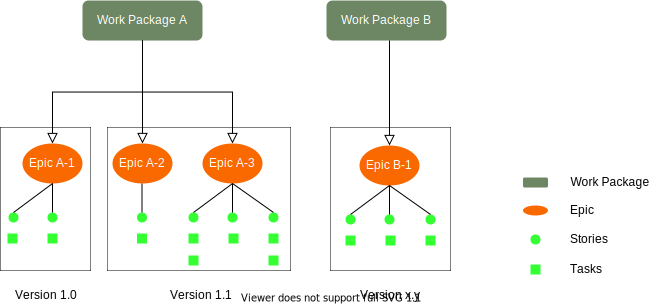

# Organization Operational Document

## Table of contents

- [Meetings](#Meetings)
- [Technical Decision Making](#Technical-Decision-Making)
- [Using Supermajority vote to achieve agreement](#Using-Supermajority-vote-to-achieve-agreement)
- [Approval Process](#Approval-Process)
- [Documentation](#Documentation)
- [Publication](#Publication)
- [Intellectual Property Rights](#Intellectual-Property-Rights)
- [Certificate of Origin](#Certificate-of-Origin)

## Meetings

```
Note: Effective group meetings allow the Steering Committee, Committee Teams and Working Groups to discuss complex issues and talk through ideas and solutions. It is recommended to keep a Meeting Minutes record for each meeting.
```

- WGs are encouraged to schedule regular conference calls.
- The Meetings MUST be announced at least, 7 days in advance for conference calls, and 1 month for face to face meetings.
- All the Organization members are contractually bound to the IPR policy under terms of the Membership Application and these IPR Guidelines must be followed.
- Meetings SHALL have an antitrust statement and an IPR call where a reminder of the IPR policy and the duties and obligations of members is provided.
- A meeting attendee list MUST be produced for each meeting. This is necessary to determine which members can vote in a Supermajority vote.

### Meeting Agenda

```
Note: An effective Meeting Agenda enable teams to organize its topics and give a fair chance for every topic to be discussed.
```

- Please refer to the Organization Agenda & Meeting Minutes [Template]()

### Meeting Minutes

```
Note: It is important to record the key issues discussed during the meeting, motions proposed or voted, and activities to be undertaken.
Also, it should be recorded meeting attendance, specially if there is a voting requirement associated with members attendance.

It is recommended to define an Agenda & Meeting Minutes template.
```

- Please refer to the Organization Agenda & Meeting Minutes [Template]()

## Technical Decision Making

### Decision Making

```
Note: the following bullet points needs to be reviewed by the group: 3.1, 3.1 and 3.2
This is to ensure that the fact of having memberships levels doesn't contradicts these rules
```

Note: from `[Organization_Abbreviation]` Scope & Governance

```
2. Decision Making.
2.1. Consensus-Based Decision Making. Working Groups make decisions through a consensus process (“Approval” or “Approved”). While the agreement of all Participants is preferred, it is not required for consensus. Rather, the Maintainer will determine consensus based on their good faith consideration of a number of factors, including the dominant view of the Working Group Participants and nature of support and objections. The Maintainer will document evidence of consensus in accordance with these requirements. Consensus will not be deemed to have been met in the event of a sustained objection from one or more Working Group participants.

2.2. Appeal Process. Decisions may be appealed via a pull request or an issue, and that appeal will be considered by the Maintainer in good faith, who will respond in writing within a reasonable time.

3. Ways of Working.
Inspired by American National Standards Institute’s (ANSI) Essential Requirements for Due Process, Community Specification Working Groups must adhere to consensus-based due process requirements. These requirements apply to activities related to the development of consensus for approval, revision, reaffirmation, and withdrawal of Community Specifications. Due process means that any person (organization, company, government agency, individual, etc.) with a direct and material interest has a right to participate by: a) expressing a position and its basis, b) having that position considered, and c) having the right to appeal. Due process allows for equity and fair play. The following constitute the minimum acceptable due process requirements for the development of consensus.

3.1. Openness. Participation shall be open to all persons who are directly and materially affected by the activity in question. There shall be no undue financial barriers to participation. Voting membership on the consensus body shall not be conditional upon membership in any organization, nor unreasonably restricted on the basis of technical qualifications or other such requirements. Membership in a Working Group’s parent organization, if any, may be required.

3.2. Lack of Dominance. The development process shall not be dominated by any single interest category, individual or organization. Dominance means a position or exercise of dominant authority, leadership, or influence by reason of superior leverage, strength, or representation to the exclusion of fair and equitable consideration of other viewpoints.

3.3. Balance. The development process should have a balance of interests. Participants from diverse interest categories shall be sought with the objective of achieving balance.

3.4. Coordination and Harmonization. Good faith efforts shall be made to resolve potential conflicts between and among deliverables developed under this Working Group and existing industry standards.

3.5. Consideration of Views and Objections. Prompt consideration shall be given to the written views and objections of all Participants.

3.6. Written procedures. This governance document and other materials documenting the Community Specification development process shall be available to any interested person.
```

As part of their responsibilities defined in [from WG Maintainers](#from-wg-maintainers), Maintainers need to ensure efficient and effective decision-making:

- The decision making process in WGs is intended to be as inclusive as possible.
- WGs shall attempt to use consensus to make decisions.
- If consensus cannot be reached, voting mechanisms MAY be used.
- Formal notice SHALL be given for decision making, e.g.:
  - Inclusion of a document on an agenda, proposing a specific decision to be taken (e.g. Pull Request).
  - Inclusion of an item directly in the agenda (e.g. proposed next meeting date).
  - Items proposed for approval via the group mailing list (e.g. agreement a document revision).
  - Inclusion of a document for decision in an electronic Review, Comment and Approval event
  - Inclusion of a document for decision in an e-vote (Supermajority) vote.

> The above list is not exhaustive.

- There SHALL be no distinction in the decision-making merit of real-time or non-real-time meetings.
  - In real-time meetings, consensus can be determined by receiving no sustained objections to a proposal.
  - In non-real-time meetings, consensus SHOULD be developed using Review, Comment and Agreement periods, e.g. using [Review and Approval](#[Organization_Abbreviation]-approval-process)
- Proposals SHALL be available for a given period.

### Seeking Consensus

- Groups shall endeavour to reach consensus on all decisions.
- Informal methods of reaching consensus are encouraged (e.g. a show of hands).
- Groups SHOULD attempt to ensure contributions relating to the same subject matter are considered together before being disposed.
- However the Maintainer SHALL ensure that progress is not delayed by unavailable contributions or participants.
- Agreement SHALL be sought in all forms of meeting.

### Handling objections when seeking consensus

- Objections from a small minority SHOULD be minuted and the objecting delegates SHOULD be questioned if having their objections minuted is sufficient and they agree to not sustain their objections.
  - If such agreements are secured, then there is consensus for approving the proposal.
  - If such agreements are not secured, then the proposal is not agreed and further action SHALL be taken (e.g. the proposal is withdrawn, updated, or voted on).
  - Members are discouraged from sustaining their objections when it is clear that they would be overruled by a vote were one to take place.
- In real-time meetings, consensus can be determined by receiving no sustained objections to a proposal.
  - Efforts to immediately resolve or record objections can be taken to attempt to achieve consensus.
- Where attendance is sparse when viewed from normal participation levels, potentially controversial proposals SHOULD be made available to the broader membership.
- The Maintainer is responsible for ensuring such opportunity for participation in the decision making process.
- Sparsely attended meetings SHOULD NOT be used to drive through proposals that would not have broad support.
- Following a decision-making meeting, a summary of decisions and document dispositions SHALL be published as soon as is practical.
  - This will be addressed if the meeting minutes are available in a timely fashion.
- When there is insufficient time for review in a real-time meeting, non-real-time consensus approaches SHOULD be considered.
- In non-real time meetings consensus SHOULD be developed by using [Review and Approval](#[Organization_Abbreviation]-approval-process) periods.
  - Using the group mailing list
  - Using GitHub "Review and Approval" label
- Proposals SHALL be available for a given period.

## Using Supermajority vote to achieve agreement

### Phrasing of Voting Questions

- The Maintainer ensures that questions to be voted upon SHALL be phrased in a concise and unambiguous manner.
- Questions SHOULD NOT be phrased as the “The group SHALL not do xyz”. Examples of appropriate questions are:
  - SHALL the group agree the Specification?
  - SHALL the liaison be approved?
  - SHALL the new Work Package be approved?
  - SHALL the existing Work Package be stopped?
  - If the issue is to choose between two options (i.e. A or B), an example of the appropriate question may be:
  - SHALL the group agree Option A or Option B?
- The option receiving no less than **3/4** of the Supermajority Votes SHALL be the decision of the group.
- If the issue is to choose between three or more options, the group SHOULD use informal voting to reduce the number of options to two, and then use formal voting, if necessary.

### Voting on Technical Issues

Note: Supermajority Vote

```
Note: Define Supermajority
```

- Before voting, a clear definition of the issues SHALL be provided by the Maintainer.
- Members eligible to vote, SHALL only be entitled to one vote each.
- Each member MAY cast its vote as often as it wishes, and the last vote it casts counts.
- Voting MAY be performed electronically.
- Voting MAY be performed by show of hands and members announcing their vote verbally one by one, or paper ballots.
- The result of the vote SHALL be recorded in the meeting minutes.
- Groups MAY use informal voting to reach consensus. If the Group is still unable to reach consensus, then a formal vote MAY be taken.
- Each member’s electronic vote SHALL be electronically acknowledged to confirm participation in the vote.
- The voting period for proposals are:
  - In-person-meetings require at least 30 days prior written notice
  - Teleconference meetings require at least 7 days prior written notice
  - Electronic voting MUST remain open for no less than 7 days.

## Approval Process

<figure>
	
	<figcaption>Review & Approval</figcaption>
</figure>

In the Standards Development Organizations (SDOs) the approval or rejection of a contribution follows a democratic process; **the majority**. This differs from an Open Source organization that normally follows a meritocratic process where the Maintainer decides what to accept of reject. If a person doesn’t like the decision that her contribution is rejected, then she can “fork” the project.

The goal for an SDO is to reach interoperability, therefore “forking” is not the solution to a technical dispute. If there is a sustainable objection in a contribution the resolution is via a vote, see [Seeking Consensus](#seeking-consensus).

The Review & Approval process implies that all the contributions need to be accepted by the Working Group.

### Review & Approval Process

- **Review period**:

  - Period of time during which the contribution will be under review before being merged.
    - The period can be: 0, 1, 2, 3, 5, 7, 14 days
    - 0 days imply that the contribution is merged without Working Group review

- **Comments or Objections**:

  - During the Review & Approval process members MAY raise **comments** or **objections**.

    - **Comments** MUST be taken in consideration by the Working Group, but they MAY be dismissed if they group thinks that are not relevant.

    - **Objections** MUST be taken in consideration and they cannot be dismissed by the Working Group without being reviewed.
    - If a contribution receives an **objection** the group MUST resolve the issue, with the person that raise the objection, before deciding the status of the contribution. If the **objection** is sustained, meaning the person doesn’t remove it, then the group will have to recur to a [vote](#voting-on-technical-issues) to resolve it.

- **Approval Criteria**:
  - A contribution is considered **approved** and therefore it can be merged if:
    - The contribution has not received any sustainable **objection** during the review period, AND
    - At least 3 reviewers have indicated that they agree with the contribution
  - If a sustained **objection** is received, the contribution cannot be merged, even if 3 or more contributors agreed with the contribution.
  - If during the review period a contribution receives a **comment**, it is up to the group or maintainer to accept the comment or not. In any case, in order to merge the contribution at least 3 reviewers MUST indicate that they agree with the contribution.

## [Organization_Abbreviation] Process Flows

### Work Packages

<figure>
	
	<figcaption>[Organization_Abbreviation] Work Units</figcaption>
</figure>

#### Work Package

- The Work Package (WP) SHALL describe the scope and expected deliverables and SHALL require WG approval
- WPs are the means by which release packages (version x.y.z) are defined

##### Epics

- It could be a feature, customer request or business requirement
- It is recommendable to define a list of Epics that will be formed the release package for the corresponding Work Package
- The WG SHOULD define a placeholder for each Epic with few lines of description
- The Epics can be broken down in user stories and tasks which are not defined in detail at the creation of the Work Package

### Technical Specifications Life Cycle

Note: from `[Organization_Abbreviation]` Scope & Governance

```
4. Specification Development Process.
4.1. Pre-Draft. Any Participant may submit a proposed initial draft document as a candidate Draft Specification of that Working Group. The Maintainer will designate each submission as a “Pre-Draft” document.

4.2. Draft. Each Pre-Draft document of a Working Group must first be Approved to become a ”Draft Specification”. Once the Working Group approves a document as a Draft Specification, the Draft Specification becomes the basis for all going forward work on that specification.

4.3. Working Group Approval. Once a Working Group believes it has achieved the objectives for its specification as described in the Scope, it will submit it to the Steering Committee for its approval.   Any Draft Specification approved by vote of the Steering Committee becomes an “Approved Specification”.

4.4. Publication and Submission. Upon the designation of a Draft Specification as an Approved Specification by the Steering Committee, the Maintainer will publish the Approved Specification in a manner agreed upon by the Steering Committee (i.e., Working Group Participant only location, publicly available location, Working Group maintained website, Working Group member website, etc.). The publication of an Approved Specification in a publicly accessible manner must include the terms under which the Approved Specification is being made available.

4.5. Submissions to Standards Bodies. The Governing Board of the LF Energy Foundation (the “Governing Board”) may submit a Draft Specification or Approved Specification to another standards development organization by vote.  No Draft Specification or Approved Specification may be submitted to another standards development organization without the vote of the Governing Board. Upon an affirmative vote of the Governing Board regarding such a submission, the applicable Maintainer or Maintainers, or any other individuals so directed by the Governing Board, will coordinate the submission of the applicable Draft Specification or Approved Specification to the other standards development organization as directed by the Governing Board. Working Group Participants that developed that Draft Specification or Approved Specification agree to grant the copyright rights necessary to make those submissions.

4.6 Steering Committee.  The Steering Committee is responsible for (a) approval of any Draft Specification as an Approved Specification and (b) alignment among each of the Working Groups of the [Organization_Name] project.

4.7.  Voting of the Steering Committee and Strategy Committee.  In any vote or Approval before the Steering Committee or Strategy Committee the affirmative vote of at least 50% of the voting members of the Steering Committee or Strategy Committee. The voting members of the Steering Committee and Strategy Committee consist of one appointee from each General Member and each Strategic Member of the LF Energy Foundation of the Linux Foundation.
```

<figure>
	
	<figcaption>Specifications Life Cycle</figcaption>
</figure>

In this section the diagram below depictures the development phases of technical documents.

<table>
  <caption>Technical Specifications Development Phases</caption>
  <thead>
    <tr>
	    <th>Phase</th>
	    <th>Description</th>
    </tr>
  </thead>
  <tbody>
    <tr>
	    <td><strong>Work Package</strong></td>
      <td>In this phase the group agrees the scope of the work to be developed.</br>
          Any member can provide a new Work Package proposal, the document is discussed among the group and further elaborated.
          The group will vote whether the Work Package is formally approved and endorsed by the majority of the group or rejected.</br>
          If the proposal is approved, the Work Package is moved to the next phase, <strong>Technical Development</strong>. </td>
    </tr>
    <tr>
	    <td><strong>Development</strong></td>
      <td>A Technical Specification MAY be composed of one or more documents:
        <ul>
          <li><strong>Requirements Document</strong>, (RD)</li>
            <ul><li>It contains the business requirements (non technical requiremnts). The business requirements are derived from the Use Cases described in the <strong>RD</strong> document.</li></ul>
          <li><strong>Architecture Document</strong>, (AD)</li>
            <ul><li>Document that describes all functional elements of the system and its interfaces or reference points.</li></ul>
          <li><strong>Technical Specification Document(s)</strong>, (TS)</li>
            <ul><li>It refers to a set of documented requirements to be satisfied by a material, design, product, or service. It helps to understand the configuration and architecture of a system.</li></ul>
          <li><strong>Supporting Document(s)</strong>, (SUP)</li>
            <ul><li>Contains profile data, metadata, schemas, etc.</li></ul>
        </ul>
        <strong>Note:</strong> in some cases the group MAY agree to develop a single document that contains the above list as sections.
        Each document will follow the phases described in the above diagram.
      </td>
   </tr>
   <tr>
	    <td><strong>Consistency Review</strong></td>
	    <td>In this phase, the document(s) developed by the WG are formally reviewed by the group. A Review period is open for members to submit their comments. After this period, the Working Group will address the issues received. </td>
   </tr>
      <tr>
	    <td><strong>WG Approval</strong></td>
	    <td>Once the WG completes the  <strong>Consistency Review</strong> the document(s) MUST be agreed by the WG (in a <strong>Review & Approval</strong>) before sending the document(s) to the Steering Committee for formal <strong>Ratification</strong>.</td>
   </tr>
   <tr>
	    <td><strong>Ratification</strong></td>
	    <td>Once the WG approves the document(s), the document(s) are sent to the Steering Committee for   <strong>Ratification</strong>.</td>
   </tr>   
   <tr>
	    <td><strong>Publication | Maintenance</strong></td>
	    <td>Upon Steering Committee <strong>Ratification</strong>, the document(s) are ready for <strong>Publication</strong>.
      <ul>
        <li>To publish the document(s), the Maintainer will create a new Release Tag.
        <li>A new <strong>Release Tag</strong> will be produce with the content in the "main" branch and stored in the Release section of the GitHub repository.</li>
        <li>The WG SHOULD open a *dialogue* with the public via <strong>GitHub Discussions</strong>.</li>
        <li>The input collected during the <strong>Maintenance</strong> phase SHOULD be used to improve the Technical Specifications as well as to collect business requirements for future releases.</li>
       </ul>
      </td>
   </tr>   
  </tbody>
</table>

<figure>
	
	<figcaption>[Organization_Abbreviation] Technical Specifications Development Phases</figcaption>
</figure>

### GitHub Flows

It is suggested to follow the principles of [Trunk Based Development](https://trunkbaseddevelopment.com/) whenever is possible.

<figure>
	
	<figcaption>[Organization_Abbreviation] GitHub Flow</figcaption>
</figure>

<table>
  <caption>GitHub Work Flow - Public Repositories</caption>
  <thead>
    <tr>
	    <th>Branch</th>
	    <th>Description</th>
    </tr>
  </thead>
  <tbody>
    <tr>
	    <td><i>Rel vX.Y.Z</i></td>
      <td> Release-tag contain all the different versions of the Technical Specifications that have been approved by the Working Group and ratified by the Technical Steering Committee. The name of the release tag will follow [Semantic Versioning](#semantic-versioning) principles.</td>
   </tr>
    <tr>
	    <td><i>main</i></td>
      <td>This branch contains the latest version of the Technical specification approved by the Working Group. Its content will be moved into a release-tag after the <strong>Consistency Review</strong> and Technical Steering Committee <strong>Ratification</strong> phases.</td>
   </tr>
  </tbody>
</table>

### GitHub Access Rights

<table>
  <caption>GitHub Access Rights</caption>
  <thead>
    <tr>
	    <th>Role</th>
	    <th>Access Rights</th>
    </tr>
  </thead>
  <tbody>
    <tr>
      <td>Participants</td>
      <td><i>TRIAGE</i> - Can read and clone this repository. Can also manage issues and pull requests.</td>
   </tr>
    <tr>
      <td>Editors</td>
      <td><i>WRITE</i> -  Can read, clone, and push to this repository. Can also manage issues and pull requests.</td>
   </tr>
   <tr>
      <td>Maintainer</td>
      <td><i>ADMINISTRATOR</i> - Can read, clone, and push to this repository. They can also manage issues, pull requests, and some repository settings.</td>
   </tr>
  </tbody>
</table>

## Publication

There are at least three different options for publishing content using GitHub:

<figure>
	
	<figcaption>Publication</figcaption>
</figure>

## Documentation

### Semantic Versioning

<figure>
	
	<figcaption>Semantic Versioning</figcaption>
</figure>

<table>
  <caption>Document Version</caption>
  <thead>
    <tr>
	    <th>Field</th>
	    <th>Use</th>
	    <th>Description</th>
    </tr>
  </thead>
  <tbody>
  <tr>
    <td>X</td>
    <td><i>Major Version Indicator</i></td>
    <td>This mandatory field SHALL identify the major version of the document as determined by the WG.
      Major versions contain major feature additions, MAY contain incompatibilities with previous document or specification revisions, and MAY change, drop, or replace existing interfaces. Initial releases are “1_0”.
    </td>
  </tr>
  <tr>
    <td>Y</td>
    <td><i>Minor Version Indicator</i></td>
    <td>Minor version of the document. This mandatory field SHALL identify the minor version of the document. It is incremented every time a minor change is made to the approved document version. Minor versions MAY contain minor feature additions, be compatible with the preceding Major_Minor specification revision, and MAY provide evolving interfaces. The initial minor release for any major release is “0”, i.e. 1_0</td>
   </tr>
   <tr>
    <td>Z</td>
    <td><i>Service Indicator</i></td>
    <td>Service indicator for the document. Incremented every time a corrective update is made to the <strong>Approved</strong> (not draft) document version by the WG.
    This field is OPTIONAL, and SHALL be provided whenever a service release of the document is made. The first service indicator release SHALL be “_1” for any Major_Minor release.
    Service indicators are intended to be compatible with the Major_Minor release they relate to but add bug fixes. No new functions will be added through the release of Service Indicators.
    </td>
  </tr>
  </tbody>
</table>

## Intellectual Property Rights

### Copyright

This section provides a recommendation based on the best practices implemented by other projects.

Most LF project communities do not require or recommend that every contributor include their copyright notice in contributed files.

Instead, many LF Project communities recommend using a more general statement in a form similar to the following: (choose one)

- `Copyright The [Organization_Name] Authors.`
- `Copyright The [Organization_Name] Contributors.`
- `Copyright Contributors to the XYZ project.`

These statements are intended to communicate the following:

- the work is copyrighted;
- the contributors of the code licensed it, but retain ownership of their copyrights; and
- it was licensed for distribution as part of the `[Organization_Name]`.

With any of the above statements, the project avoids having to maintain lists of names of the authors or copyright holders, years or ranges of years, and variations on the (c) symbol.
This aims to minimize the burden on the contributors and maintainers.

This section provides a recommended format for ease of use, but it is not mandated.

> Note: You may consider discussing with your legal department whether they require you to include a copyright notice identifying the employer as the copyright holder in contributions. Many of LF members' legal departments have already approved the above
> recommended practice.

#### Reasons to Avoid Listing Copyright Holders

These are some of the reasons why `[Organization_Abbreviation]` does not recommend trying to list every copyright holder for contributions to every file:

- Copyright notices are not mandatory in order for the contributor to retain ownership of their copyright.
- Copyright notices are rarely kept up to date as documentation evolves, resulting inaccurate statements.
- Trying to keep notices up to date, or to correct notices that have become inaccurate, increases the burden on editors and maintainers without tangible benefit.
- Editors and maintainers often do not want to have to worry about e.g. whether a minor contribution (such as a type fix) means that a new copyright notice should be added.

#### Other Copyright Rules

- If your contribution contains content from a third party source who didn't contribute it themselves, then you should not add the notice above.
- You should not change or remove someone else's copyright notice unless they have expressly (in writting) permitted you to do so.

### Licenses

This section provides a recommendation on how to communicate software or document licenses information in a project.

#### Software Code Licenses

Ideally, the project SHOULD communicate the software license information via three different metods:

- In the README file
- Inside of the repository with a `License.txt` document
- Inside of each code file created by the group

#### Statement in README File

Insert in the README file the MIT License:

```


```

The README file will display:

- 

In addition, it is recommended to include a plain text statement of the license in the README file, for accessibility purposes as well as enabling parsing by automated tooling. This can be done by including a "License" section with:

- This project is licensed under the MIT license.

#### License File in the Repository

Insert in the repository a file called `License.txt`.

The Maintainer can copy the corresponding license file from the [templates/license]() repository and upload it to the project repository.

#### License Reference in each Source Code File

The recommendation is that projects SHOULD use [SPDX short-form license identifiers](https://spdx.dev/ids/) in all source code and documentation files that are **original to the project**.

Each source code created by the project SHOULD have one of these SPDX license identifiers: (depending on the type of source code license allocated to the project)

- **for an MIT license:**

```
# SPDX-License-Identifier: MIT
# Copyright Contributors to the [Organization_Name]
```

If the project needs to include source code or documents from a different upstream project, the recommendation is to retain those files in **unmodified form** _**(don't add identifiers)**_.

Also consider to:

- keep these files in sync with the upstream project
- ask the upstream project to insert the identifiers on their source code files / documents.

### [Organization_Name] Software License Policy

This policy is intended to assist `[Organization_Name]` Technical Working Groups to handle Software Licenses in the Projects.

#### Recommended SafeGuards

**1. Escalation Path**

- Any question about licensing should be resolved by the Working Group (WG), if the WG cannot resolve it, then the question can be sent to the Technical Steering Committee (TSC)
  - LF doesn’t provide legal advice or comments about license compatibility (unless LF identifies some clear incompatibilities)
  - The Steering members may need to involve their Legal Counsel to make a license decision
  - Only the TSC can decide if a component created by the Project can be delivered under a different license than the Project License

**2. Linked Libraries & 3 Party Software**

- It is not recommended to pull software code, under different license than the Project License, into the project repository. Use linked libraries instead.
- If 3rd party software is embedded, it should be under the Project License. If different licenses are used, then create a NOTICE file listing all the 3rd party license notice.
- As a rule, if a software code developed by `[Organization_Name]` has an external dependency to a code distributed under GPL 2.0, then `[Organization_Name]` members need to consult with their legal counsel to decide under what license the `[Organization_Name]` software code should be released. In other words, if the code developed by `[Organization_Name]` doesn’t work without the reference to the external code under GPL 2.0, then the license to release the `[Organization_Name]` code should be evaluated.

**3. License Compatibility**

- Any upstream license needs to be compatible with the Project License
- Any copyleft license inserted in a project repository needs to be flagged to the Organization Team

**4. Binary Distribution**

- It is a good practice to point users to the libraries so they can compile them on their own
- If the group decides to ship binaries, the binaries should be ONLY for the code developed under the Project License.
- If there are any other binaries under different license, then each binary should be distributed in its own files. Binaries under a license different than the Project License CANNOT packed with the same binaries than the ones created by the group

### Technical Document License

In projects where the main deliverables are technical documents, each document MUST have a legal disclaimer.

The legal disclaimer to insert in each project document SHOULD be:

```
© `[Organization_Abbreviation]` 2022, All rights reserved.

“THESE MATERIALS ARE PROVIDED “AS IS.”  The parties expressly disclaim any warranties
(express, implied, or otherwise), including implied warranties of merchantability, non-infringement,
fitness for a particular purpose, or title, related to the materials. The entire risk as to
implementing or otherwise using the materials is assumed by the implementer and user.

IN NO EVENT WILL THE PARTIES BE LIABLE TO ANY OTHER PARTY FOR LOST PROFITS OR ANY FORM OF
INDIRECT, SPECIAL, INCIDENTAL, OR CONSEQUENTIAL DAMAGES OF ANY CHARACTER FROM ANY CAUSES
OF ACTION OF ANY KIND WITH RESPECT TO THIS DELIVERABLE OR ITS GOVERNING AGREEMENT, WHETHER
BASED ON BREACH OF CONTRACT, TORT (INCLUDING NEGLIGENCE), OR OTHERWISE, AND WHETHER OR NOT
THE OTHER MEMBER HAS BEEN ADVISED OF THE POSSIBILITY OF SUCH DAMAGE.”
```

## :medal_sports: Certificate of Origin

_Developer's Certificate of Origin 1.1_

By making a contribution to this project, I certify that:

> 1. The contribution was created in whole or in part by me and I have the right to submit it under the open source license indicated in the file; or
> 1. The contribution is based upon previous work that, to the best of my knowledge, is covered under an appropriate open source license and I have the right under that license to submit that work with modifications, whether created in whole or in part by me, under the same open source license (unless I am permitted to submit under a different license), as indicated in the file; or
> 1. The contribution was provided directly to me by some other person who certified (1), (2) or (3) and I have not modified it.
> 1. I understand and agree that this project and the contribution are public and that a record of the contribution (including all personal information I submit with it, including my sign-off) is
> 1.

### Source Code

Working Group Participants contributing source code to this Working Group agree that those source code contributions are subject to the Developer Certificate of Origin version 1.1, available at http://developercertificate.org/, the license indicated below, and any policies and governance rules included in the source code’s repository. Source code may not be a required element of an Approved Deliverable specification. - [See DCO](https://github.com/OvertureMaps/template-repo/blob/main/dco.md)

### Dataset

Working Group contributing data to a dataset to this Working Group agree that those data contributions are subject to the license
indicated below. The dataset may not be a required element of an Approved Deliverable specification.

```
Data contributed to ODBL licensed datasets will be contributed under both the ODBL and CDLA permissive v2.
Contributions to CDLA permissive v2 datasets will be contributed under the CDLA permissive v2.
```

### Patent Licensing

Each Working Group must specify the patent mode under which it will operate prior to initiating any work on any Draft Deliverable or Approved Deliverable other than source code or datasets. The patent mode for this Working Group is;

```
No Patent License. No patent licenses are granted for the Draft Deliverables or Approved Deliverables developed by this Working Group.
```
